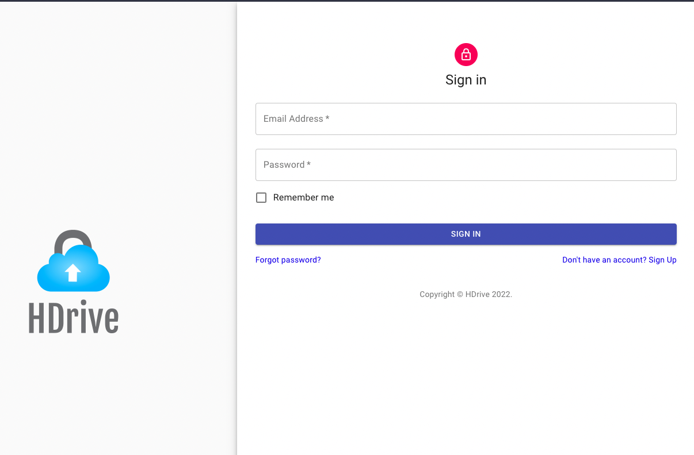
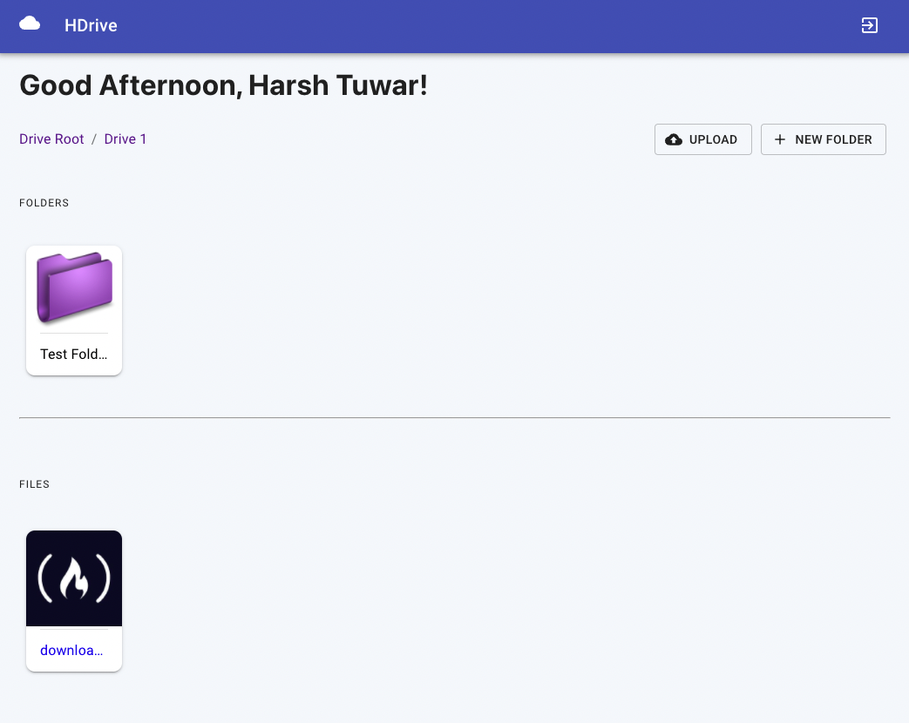

# HDrive - My Personal Google Drive

HDrive is a file storage service which I developed to learn about the firebase. It uses:
- React
- Firebase
- Redux (Redux Thunk)
- Material UI
- Localforage



<br />



<br />


## ⬇️ Installation

```sh
# clone repository
git clone https://github.com/Harsh-Tuwar/HDrive.git

# install dependencies
npm install
```

Create an .env file and put it in the root (on the same level as `src`) and add your firebase config object as described below:

```js
const firebaseConfigMaster = {
	apiKey: process.env.REACT_APP_API_KEY,
	authDomain: process.env.REACT_APP_AUTH_DOMAIN,
	projectId: process.env.REACT_APP_PROJECT_ID,
	storageBucket: process.env.REACT_APP_STORAGE_BUCKET,
	messagingSenderId: process.env.REACT_APP_MESSAGING_SENDER_ID,
	appId: process.env.REACT_APP_APP_ID
};
```

```sh
# run dev server
npm run dev
```